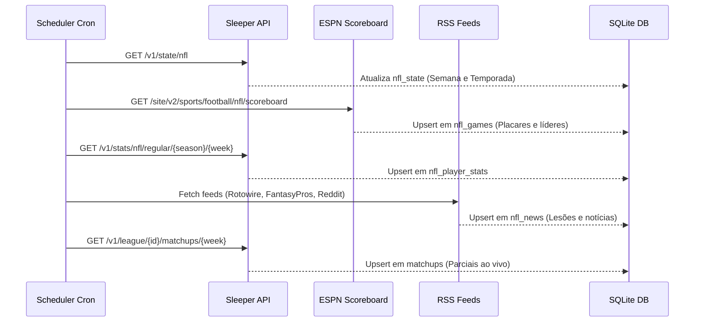
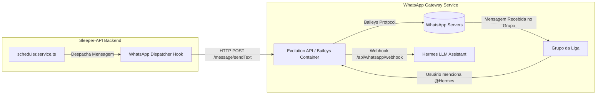

# 🧠 AI & Developer Implementation Guide: Sleeper Fantasy WhatsApp Bot ("Hermes")

> **Documento de referência técnica completo para agentes de IA e engenheiros de software continuarem o desenvolvimento, integrarem gateways de WhatsApp e expandirem as capacidades do motor editorial Hermes.**

---

## 📑 Sumário

1. [Visão Geral & Filosofia do Projeto](#1-visão-geral--filosofia-do-projeto)
2. [Mapa da Estrutura de Arquivos](#2-mapa-da-estrutura-de-arquivos)
3. [Arquitetura de Dados & Schemas (SQLite)](#3-arquitetura-de-dados--schemas-sqlite)
4. [Pipeline de Coleta de Dados (Fontes 100% Gratuitas)](#4-pipeline-de-coleta-de-dados-fontes-100-gratuitas)
5. [Motor de Base de Conhecimento (99 Arquivos Markdown)](#5-motor-de-base-de-conhecimento-99-arquivos-markdown)
6. [Cronograma Editorial dos 13 Slots & Gatilhos](#6-cronograma-editorial-dos-13-slots--gatilhos)
7. [Engenharia de Fuso Horário & Gatilho do Slot 12 (CRÍTICO)](#7-engenharia-de-fuso-horário--gatilho-do-slot-12-crítico)
8. [Persona do Hermes & Chamada de Ferramentas (LLM)](#8-persona-do-hermes--chamada-de-ferramentas-llm)
9. [Blueprint de Integração com Gateways de WhatsApp](#9-blueprint-de-integração-com-gateways-de-whatsapp)
10. [Suíte de Testes, Validação & Comandos](#10-suíte-de-testes-validação--comandos)
11. [Pegadinhas Conhecidas (*Gotchas*) & Boas Práticas](#11-pegadinhas-conhecidas-gotchas--boas-práticas)

---

## 1. Visão Geral & Filosofia do Projeto

### O que é este projeto?
É um **motor autônomo de inteligência, análise histórica e cronograma editorial semanal** para ligas de Fantasy Football hospedadas na plataforma **Sleeper**. O sistema foi construído para atuar como o **comentarista oficial** dos grupos de WhatsApp dessas ligas, assumindo o alter-ego de **Hermes**: sarcástico, bem-informado, fã fervoroso de futebol americano e impiedoso com managers que escalam mal.

### Diretrizes de Engenharia:
1. **Zero APIs Pagas:** Todo o fluxo depende exclusivamente de fontes gratuitas:
   * **Sleeper Public API** (sem autenticação, taxa de limite generosa).
   * **ESPN Public Scoreboard API** (placar ao vivo, líderes estatísticos).
   * **RSS Feeds Abertos** (FantasyPros, Rotowire, Yahoo, ProFootballTalk, Reddit).
2. **Zero Configuração de Banco:** SQLite local (`better-sqlite3`) com migrações versionadas em `src/migrations/`.
3. **Dual-Layer Context:**
   * **Structured Layer:** Banco SQLite estruturado para buscas relacionais ultra-rápidas e ordenação estatística.
   * **Document Layer:** 99 arquivos Markdown estruturados em `knowledge_base/`, permitindo indexação RAG direta ou injeção em contextos de LLM.
4. **Foco no Fuso de Brasília (`America/Sao_Paulo`, UTC-3):** Toda a inteligência temporal é rigorosamente sincronizada com o horário de Brasília, com compensação matemática contínua das variações do horário de verão americano e jogos internacionais.

---

## 2. Mapa da Estrutura de Arquivos

```
Sleeper-API/
├── src/
│   ├── config/
│   │   └── database.ts                 # Conexão SQLite (better-sqlite3), helpers query(), execute()
│   ├── migrations/
│   │   ├── 001_initial_schema.sql      # Tabelas Sleeper (leagues, rosters, matchups, transactions, players)
│   │   ├── 002_nfl_and_kb_schema.sql   # Tabelas NFL (nfl_games, nfl_player_stats, projections, news)
│   │   ├── 003_bot_schedule_schema.sql # Tabelas do Bot (bot_message_log, live_game_tracker)
│   │   ├── run.ts                      # Executor de migrações
│   │   └── seed.ts                     # Seed inicial opcional
│   ├── routes/
│   │   └── api.routes.ts               # Express Router (Health, Stats, Leagues, Bot Previews, Sync)
│   ├── scripts/
│   │   ├── sync-players.ts             # Baixa todos os ~12k jogadores da Sleeper
│   │   ├── sync-all.ts                 # Sincroniza ligas, elencos, confrontos e transações
│   │   ├── kb-sync.ts                  # Sincronização completa (Scoreboard + Stats + Notícias)
│   │   ├── kb-generate.ts              # Gera os 99 arquivos Markdown da knowledge_base/
│   │   ├── test-schedule.ts            # Testa a geração dos 13 slots editoriais no terminal
│   │   └── test-triggers.ts            # Simula e valida os gatilhos temporais do Slot 12
│   ├── services/
│   │   ├── sleeper-api.service.ts      # Cliente HTTP para a API oficial do Sleeper
│   │   ├── sync.service.ts             # Orquestrador de sincronização dos dados do Sleeper
│   │   ├── nfl-collector.service.ts    # Coletor da ESPN (Scoreboard) e Sleeper (Stats/Projeções)
│   │   ├── news-scraper.service.ts     # Scraper RSS de notícias de lesões e boatos da NFL
│   │   ├── league-analytics.service.ts # Análise histórica de confrontos (H2H), rivalidades e recordes
│   │   ├── kb-generator.service.ts     # Gerador dos 99 arquivos Markdown
│   │   ├── weekly-schedule.service.ts  # Gerador dos textos das 13 mensagens da agenda semanal
│   │   ├── scheduler.service.ts        # Cron dispatcher dos slots e sincronizações diárias
│   │   ├── game-watcher.service.ts     # Polling ao vivo de apito final da ESPN
│   │   └── hermes-agent.service.ts     # Definição do agente LLM Hermes e suas ferramentas
│   └── index.ts                        # Entrypoint do servidor Express
├── knowledge_base/                     # 99 arquivos Markdown organizados por liga, NFL e persona
│   ├── leagues/                        # Histórico, rivalidades, elencos e transações por família
│   ├── nfl/                            # Calendário, notícias de lesões e tendências da NFL
│   └── agent/
│       ├── system_prompt_persona.md    # Prompt de sistema oficial do Hermes
│       └── tool_definitions.json       # Definições de tools para chamadas de função LLM
├── data/
│   ├── .gitkeep                        # Mantém pasta rastreada no Git
│   └── sleeper.db                      # Banco SQLite (ignorado pelo .gitignore)
├── package.json                        # Scripts npm e dependências
├── tsconfig.json                       # Configuração TypeScript
└── .gitignore                          # Ignora node_modules, data/*.db, .env e dist/
```

---

## 3. Arquitetura de Dados & Schemas (SQLite)

O banco é criado e gerenciado via migrações SQL em `src/migrations/`.

### Principais Tabelas:

#### A. Ecossistema Sleeper (`001_initial_schema.sql`):
* `leagues`: Registro de cada edição anual da liga (`league_id`, `name`, `season`, `status`, `total_rosters`, `settings`, `is_active`).
* `rosters`: Times participantes de cada liga (`roster_id`, `owner_id`, `league_id`, `settings`, `starters`, `players`).
* `sleeper_users`: Perfis dos managers com `user_id`, `display_name` e avatares.
* `matchups`: Pontuações semanais (`league_id`, `week`, `roster_id`, `matchup_id`, `points`, `starters`, `starters_points`).
* `transactions`: Waivers e trocas concluídas (`transaction_id`, `type`, `status`, `adds`, `drops`, `settings`).
* `players`: Catálogo da NFL (`player_id`, `full_name`, `position`, `team`, `injury_status`, `years_exp`).

#### B. Camada NFL & Notícias (`002_nfl_and_kb_schema.sql`):
* `nfl_games`: Scoreboard oficial da ESPN (`game_id`, `season`, `week`, `home_team`, `away_team`, `home_score`, `away_score`, `status`, `game_date`, `leaders`).
* `nfl_player_stats`: Estatísticas detalhadas jogo a jogo vindas da Sleeper (`player_id`, `season`, `week`, `pts_ppr`, `stats`).
  * O campo `stats` é um JSON contendo `pass_yd`, `pass_td`, `pass_int`, `rush_yd`, `rec`, `rec_yd`, `fum_lost`, etc.
* `nfl_player_projections`: Projeções de pontos PPR semanais (`player_id`, `season`, `week`, `proj_pts_ppr`).
* `nfl_news`: Notícias agregadas por RSS (`news_id`, `source`, `category`, `title`, `summary`, `link`, `published_at`).

#### C. Controle Operacional do Bot (`003_bot_schedule_schema.sql`):
* `bot_message_log`: Histórico de mensagens disparadas para evitar envios duplicados:
  ```sql
  CREATE TABLE IF NOT EXISTS bot_message_log (
      id INTEGER PRIMARY KEY AUTOINCREMENT,
      league_id TEXT NOT NULL,
      slot_key TEXT NOT NULL,
      season TEXT NOT NULL,
      week INTEGER NOT NULL,
      message_type TEXT NOT NULL,
      message_text TEXT NOT NULL,
      metadata TEXT,
      sent_at TEXT DEFAULT (datetime('now')),
      status TEXT DEFAULT 'sent',
      UNIQUE(league_id, slot_key, season, week)
  );
  ```
* `live_game_tracker`: Rastreamento de estado de jogos para disparar flash no apito final (`game_id`, `has_final_triggered`).

---

## 4. Pipeline de Coleta de Dados (Fontes 100% Gratuitas)



1. **`sleeper-api.service.ts`:**
   * Utiliza Axios para comunicação com endpoints REST do Sleeper.
   * Não requer chaves de API.
2. **`nfl-collector.service.ts`:**
   * Busca placares atualizados da ESPN com endpoint público:
     `https://site.api.espn.com/apis/site/v2/sports/football/nfl/scoreboard?week={week}&season={season}`
   * Converte o horário UTC (`event.date`) para armazenamento padronizado em ISO 8601.
3. **`news-scraper.service.ts`:**
   * Utiliza `fast-xml-parser` para fazer parsing de feeds RSS abertos com sanitização de HTML e classificação automática por palavras-chave (`injury`, `trade`, `general`).

---

## 5. Motor de Base de Conhecimento (99 Arquivos Markdown)

A classe `KBDocumentGenerator` (`src/services/kb-generator.service.ts`) gera uma estrutura hierárquica completa em `knowledge_base/`:

```
knowledge_base/
├── README.md                           # Índice mestre com sitemap de todas as ligas e arquivos
├── agent/
│   ├── system_prompt_persona.md        # Prompt de sistema mestre para o Hermes
│   └── tool_definitions.json           # Schemas de funções/tools para uso com Function Calling
├── nfl/
│   ├── schedule_week_1.md              # Calendário e odds dos jogos da semana
│   ├── trending_players.md             # Jogadores mais adicionados/dropados no Sleeper
│   └── injury_report.md                # Compilação dos últimos boletins médicos
└── leagues/
    └── <slug-da-familia>/
        ├── overview.md                 # Resumo histórico da família de ligas (2019 - Presente)
        ├── head_to_head_matrix.md      # Matriz de confronto direto manager x manager
        ├── all_time_records.md         # Maiores lavadas, maiores pontuações, placares mais apertados
        ├── season_<ano>/
        │   ├── standings.md            # Classificação da temporada
        │   ├── rosters.md              # Elencos completos de cada time
        │   └── matchups_week_<num>.md  # Confrontos detalhados e pontuações da semana
```

*Para atualizar a base inteira, execute `npm run kb:generate`.*

---

## 6. Cronograma Editorial dos 13 Slots & Gatilhos

O motor de agendamento em `src/services/scheduler.service.ts` roda a cada 5 minutos (`*/5 * * * *`) e despacha 13 mensagens semanais através do `WeeklyScheduleService`:

### Mapa dos 13 Slots Semanais:

| # | Slot Key | Dia & Horário (BRT) | Nome do Bloco | Função Geradora |
| :- | :--- | :--- | :--- | :--- |
| **1** | `tue_08h_recap` | Terça 08:00 | Fechamento Ácido & Raio-X | `generateTuesdayRecap(leagueId, week)` |
| **2** | `wed_08h_waiver_radar` | Quarta 08:00 | Radar do Waiver Wire | `generateWednesdayWaiverRadar(leagueId)` |
| **3** | `opening_08h_waivers` | Kickoff Day 08:00 | Bloco 1: Plantão do Waiver | `generateOpeningDay08hWaivers(leagueId, week)` |
| **4** | `opening_09h_standings`| Kickoff Day 09:00 | Bloco 2: Termômetro da Liga | `generateOpeningDay09hStandings(leagueId, week)` |
| **5** | `opening_10h_matchups` | Kickoff Day 10:00 | Bloco 3: Card de Duelos (H2H) | `generateOpeningDay10hMatchups(leagueId, week)` |
| **6** | `opening_11h_injuries` | Kickoff Day 11:00 | Bloco 4: Boletim Médico | `generateOpeningDay11hInjuries(leagueId, week)` |
| **7** | `opening_12h_trashtalk`| Kickoff Day 12:00 | Bloco 5: Trash Talk Abertura | `generateOpeningDay12hTrashTalk(leagueId, week)` |
| **8** | `sun_08h_waivers_recap`| Domingo 08:00 | Bloco 1: Rescaldo & Waivers | `generateSunday08hWaiversAndRecap(leagueId, week)` |
| **9** | `sun_09h_matchups_update`| Domingo 09:00 | Bloco 2: Card Atualizado | `generateSunday09hMatchupCardUpdate(leagueId, week)` |
| **10**| `sun_10h_injuries` | Domingo 10:00 | Bloco 3: Boletim Dominical | `generateSunday10hInjuries(leagueId, week)` |
| **11**| `sun_11h_trashtalk` | *Kickoff - 120min* | Bloco 4: Trash Talk Pré-Jogo | `generateSunday11hTrashTalk(leagueId, week)` |
| **12**| `sun_11h30_inactives` | *Kickoff - 90min* | 🚨 **Alerta de Inativos** | `generateSundayInactivesAlert(leagueId, week)` |
| **13**| `mon_08h_decisions` | Segunda 08:00 | Especial Monday Night | `generateMondayDecisions(leagueId, week)` |
| **⚡**| `game_final_<id>` | *Tempo Real (ESPN)* | Flash Fim de Jogo | `generateGameFinalFlash(leagueId, game, week)` |

---

## 7. Engenharia de Fuso Horário & Gatilho do Slot 12 (CRÍTICO)

> [!CAUTION]
> **LEITURA OBRIGATÓRIA PARA QUALQUER IA OU ENGENHEIRO:**
> O Brasil **não possui horário de verão** (fixo em UTC-3 o ano todo). Nos EUA, a NFL começa sob o **EDT** (UTC-4) e em novembro vira para **EST** (UTC-5). Isso altera os horários dos jogos no Brasil em 1 hora!

### Variação do 1º Kickoff de Domingo no Brasil:
* **Setembro e Outubro (EUA em EDT - diferença de 1h para Brasília):**
  * 1:00 PM EDT = **14:00 BRT**.
  * Slot 12 (Kickoff - 90min): **12:30 BRT**.
  * Slot 11 (Kickoff - 120min): **12:00 BRT**.
* **Novembro a Janeiro (EUA em EST - diferença de 2h para Brasília):**
  * 1:00 PM EST = **15:00 BRT** (Jogos começam 1 hora mais tarde no Brasil!).
  * Slot 12 (Kickoff - 90min): **13:30 BRT**.
  * Slot 11 (Kickoff - 120min): **13:00 BRT**.
* **Jogos Internacionais de Domingo (Londres às 9:30 AM ET):**
  * Em Outubro: **10:30 BRT** ➡️ Slot 12: **09:00 BRT**; Slot 11: **08:30 BRT**.
  * Em Novembro: **11:30 BRT** ➡️ Slot 12: **10:00 BRT**; Slot 11: **09:30 BRT**.

### A Regra de Implementação do Gatilho do Slot 12:
**NUNCA use comparação de strings de hora/minuto** (`hour === 11 && minute === 30`). 
O cron roda a cada 5 minutos; se o processo atrasar 1 segundo ou reiniciar às 12:30, qualquer checagem de minuto exato falhará e o alerta será ignorado.

**Use sempre a Janela Temporal por Carimbo de Data/Hora (*Epoch Timestamps*):**
```typescript
// Localizado em src/services/scheduler.service.ts
const nowMs = Date.now();
const inactivesAlertMs = sundayTimes.inactivesAlertDate.getTime(); // Exatos Kickoff - 90min
const kickoffMs = sundayTimes.kickoffDate.getTime();

// Dispara na PRIMEIRA execução entre a liberação da lista oficial e o pontapé inicial
if (nowMs >= inactivesAlertMs && nowMs < kickoffMs) {
    tryDispatch('sun_11h30_inactives', () => weeklySchedule.generateSundayInactivesAlert(league.league_id, currentWeek));
}
```

*O método `tryDispatch` impede duplicações através da constraint `UNIQUE(league_id, slot_key, season, week)` na tabela `bot_message_log`.*

---

## 8. Persona do Hermes & Chamada de Ferramentas (LLM)

### Prompt de Sistema
O arquivo `knowledge_base/agent/system_prompt_persona.md` define a voz e limites do bot:
* **Tom:** Impiedoso, sarcástico, provocativo, porém baseado **estritamente em dados reais**.
* **Gírias de Fantasy no Brasil:** *Amassar*, *bater carteira*, *ficar no churrasco*, *lei do ex*, *dormir no ponto*, *banca quebrou*, *cornetar*.
* **Regra de Ouro:** Nunca inventar placares, nunca alucinar pontuações. Se não constar no SQLite ou nos arquivos `.md`, admitir desconhecimento com deboche.

### Definição de Tools (`knowledge_base/agent/tool_definitions.json`):
Contém schemas OpenAPI para Function Calling:
* `get_league_standings`: Classificação e pontuação total.
* `get_matchup_details`: Parciais de confronto da semana.
* `get_head_to_head`: Histórico de confrontos diretos entre dois managers desde 2019.
* `get_nfl_injuries`: Notícias recentes de lesões.
* `get_waiver_activity`: Movimentações financeiras e transações recentes.

---

## 9. Blueprint de Integração com Gateways de WhatsApp

Para conectar este motor backend a um grupo real de WhatsApp, utilize qualquer gateway HTTP (Evolution API, Baileys, Z-API, WppConnect).

### Arquitetura de Conexão:



### Exemplo Prático de Código de Envio (Evolution API):

No arquivo `src/services/scheduler.service.ts`, substitua o `console.log` do `tryDispatch` por uma chamada HTTP:

```typescript
import axios from 'axios';

// Mapeamento configurável de league_id do Sleeper para JID do WhatsApp
const LEAGUE_TO_WHATSAPP_GROUP: Record<string, string> = {
    '123456789012345678': '120363024829381023@g.us'
};

async function sendToWhatsApp(leagueId: string, messageText: string): Promise<void> {
    const groupId = LEAGUE_TO_WHATSAPP_GROUP[leagueId] || process.env.DEFAULT_WHATSAPP_GROUP;
    if (!groupId) return;

    const evolutionUrl = process.env.EVOLUTION_API_URL || 'http://localhost:8080';
    const apiKey = process.env.EVOLUTION_API_KEY;
    const instance = process.env.EVOLUTION_INSTANCE || 'hermes-bot';

    try {
        await axios.post(
            `${evolutionUrl}/message/sendText/${instance}`,
            {
                number: groupId,
                text: messageText,
                delay: 1200
            },
            {
                headers: { 'apikey': apiKey }
            }
        );
    } catch (err: any) {
        console.error(`[WHATSAPP DISPATCH ERROR] Falha ao enviar para grupo ${groupId}:`, err.message);
    }
}
```

---

## 10. Suíte de Testes, Validação & Comandos

Antes de realizar commits ou subir versões em produção, execute sempre a sequência de validação:

```bash
# 1. Checagem estrita de tipos TypeScript (Sem compilação)
npx tsc --noEmit

# 2. Teste de Fuso Horário e Gatilhos do Slot 12 (Simulação de ticks)
npm run bot:triggers

# 3. Teste de Renderização de Conteúdo dos 13 Slots
npm run bot:schedule

# 4. Sincronização e Geração da Base de Conhecimento
npm run kb:sync
npm run kb:generate
```

---

## 11. Pegadinhas Conhecidas (*Gotchas*) & Boas Práticas

1. **Valores `"null"` em colunas de texto do SQLite:**
   * No Sleeper, colunas como `settings`, `adds` e `starters` podem ser gravadas no SQLite com a string literal `"null"`.
   * **Sempre faça:**
     ```typescript
     const adds = (row.adds ? (typeof row.adds === 'string' ? JSON.parse(row.adds) : row.adds) : null) || {};
     ```
2. **Resolução de Temporadas Divergentes:**
   * A temporada ativa da liga no Sleeper pode ser anterior à temporada ao vivo da NFL (ex: Sleeper em 2025 e NFL em 2026).
   * **Use sempre:** os métodos auxiliares `resolveNflSeason(leagueSeason, week)` e `resolveNflGamesSeason(leagueSeason, week)` em `WeeklyScheduleService` para garantir que as estatísticas e os jogos correspondam aos dados existentes no banco.
3. **Atletas vs Agregados de Time:**
   * A Sleeper grava registros agregados de franquia com IDs como `TEAM_CHI` ou `TEAM_NO` na tabela de estatísticas.
   * **Sempre adicione:** `WHERE s.player_id NOT LIKE 'TEAM_%'` ao calcular líderes individuais e destaques da rodada.
4. **Sem Concorrência de Escrita no SQLite:**
   * O driver `better-sqlite3` é síncrono e opera em processo único. Evite disparar múltiplos processos concorrentes que executem `INSERT`/`UPDATE` simultâneos para evitar `database is locked`.
