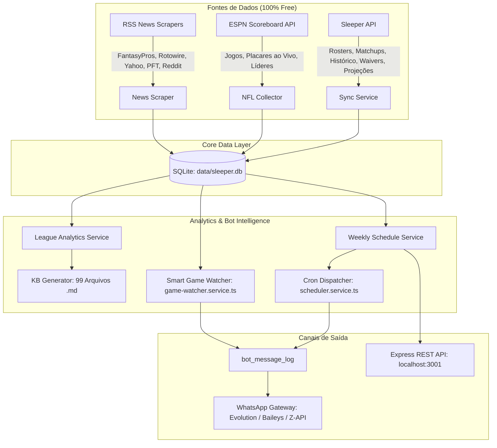

# 🏈 Sleeper Fantasy Football + NFL WhatsApp Bot Engine ("Hermes")

> **Motor autônomo de inteligência, base de conhecimento e cronograma editorial semanal para grupos de WhatsApp de ligas do Sleeper Fantasy Football.**

---

## 📖 Visão Geral

O **Sleeper Fantasy Assistant & Bot Engine** transforma dados brutos da NFL e do Sleeper em entretenimento e informação em tempo real para os membros da sua liga no WhatsApp. 

O sistema conta com o **Hermes**, um comentarista com persona ácida, sarcástica e bem-humorada, alimentado por um banco de dados local SQLite e uma **Knowledge Base de 99 arquivos Markdown**, gerando relatórios de pré-rodada, parciais ao vivo, alertas de inativos e fechamentos semanais com estatísticas reais.

### ✨ Principais Recursos

* 🤖 **Hermes WhatsApp Bot:** Comentarista automatizado com personalidade ácida que analisa desempenho de times e atletas, caçoa de derrotas humilhantes e exalta os vencedores (*Rei da Semana* vs *Mico da Rodada*).
* 📅 **Cronograma Editorial de 13 Slots Semanais:** Cobertura do início ao fim da rodada:
  * **Terça 08:00 BRT:** Fechamento Geral Ácido & Raio-X Completo (NFL + Fantasy).
  * **Quarta 08:00 BRT:** Radar do Waiver Wire (Alvos mais cobiçados e tendências).
  * **Dia do Kickoff (08h - 12h BRT):** Maratona de Abertura dividida em 5 blocos (Waivers, Classificação, Duelos H2H, Boletim Médico e Trash Talk).
  * **Domingão de Jogos:** 
    * 08:00: Rescaldo dos primeiros jogos e waivers de sábado para domingo.
    * 09:00: Card de confrontos atualizado com parciais.
    * 10:00: Boletim médico dominical.
    * Kickoff - 120min: Aquecimento e Trash Talk do domingão.
    * **Kickoff - 90min (Slot 12):** **Alerta Vermelho de Inativos** avisando individualmente quem tem titular confirmado como fora (`OUT`, `IR`, `DOUBTFUL`).
  * **Segunda 08:00 BRT:** Especial Monday Night Football (decididos vs dramas em aberto).
* ⚡ **Gatilho Inteligente de Jogos ao Vivo (`GameWatcher`):** Polling a cada 2 minutos da API da ESPN para detectar o apito final de qualquer jogo da NFL e disparar um flash imediato no grupo com placar e parciais da liga.
* 🕒 **Blindagem do Fuso Horário de Brasília (`America/Sao_Paulo`, UTC-3):** Cálculos dinâmicos por carimbo de data/hora (*epoch timestamps*) que se adaptam automaticamente ao fim do Horário de Verão Americano (EDT para EST em novembro) e a jogos internacionais em Londres/Alemanha.
* 📚 **Gerador Autônomo de Knowledge Base (99 arquivos .md):** Gera dossiês detalhados em `knowledge_base/` com histórico de confrontos diretos desde 2019, maiores lavadas, placares mais apertados, contexto dos elencos e prompts prontos para LLMs.
* 💸 **100% Gratuito & Open-Source:** Utiliza apenas APIs gratuitas (Sleeper API pública, ESPN scoreboard, feeds RSS de notícias). Sem dependências pagas.

---

## 🏗️ Arquitetura do Sistema



---

## 🚀 Como Iniciar o Projeto

### Pré-requisitos
* **Node.js:** versão 18.0.0 ou superior.
* **npm:** versão 9.0.0 ou superior.

### 1. Clonar o Repositório e Instalar Dependências
```bash
git clone https://github.com/SEU_USUARIO/Sleeper-API.git
cd Sleeper-API
npm install
```

### 2. Configurar Variáveis de Ambiente
Copie o arquivo de exemplo `.env.example` para `.env`:
```bash
cp .env.example .env
```
Edite `.env` se desejar customizar a porta (`PORT=3001`), o fuso horário ou o usuário inicial do Sleeper (`SLEEPER_USERNAME`).

### 3. Executar as Migrações do Banco de Dados
Cria as tabelas do Sleeper, tabelas da NFL, Knowledge Base e logs do bot:
```bash
npm run db:migrate
```

### 4. Sincronizar Dados dos Jogadores da NFL (Primeira Execução)
Baixa o catálogo oficial de ~12.000 jogadores da NFL via Sleeper API:
```bash
npm run sync:players
```

### 5. Sincronização Completa (Ligas + Jogos + Notícias + Projeções)
```bash
npm run kb:sync
```
*Este comando baixa as ligas configuradas, histórico de confrontos, jogos da ESPN, notícias de lesões e projeções de pontos.*

### 6. Gerar a Base de Conhecimento em Markdown
```bash
npm run kb:generate
```
*Gera 99 arquivos `.md` organizados dentro de `knowledge_base/` prontos para agentes LLM.*

### 7. Iniciar o Servidor de Background (API + Cron + Game Watcher)
```bash
npm run dev
```
O servidor iniciará:
* 🌐 **API REST:** `http://localhost:3001/api`
* 🤖 **Bot Editorial Dispatcher:** cron a cada 5 minutos (`*/5 * * * *`) disparando os slots no horário de Brasília.
* ⚡ **Smart Game Watcher:** cron a cada 2 minutos (`*/2 * * * *`) monitorando o apito final dos jogos da NFL na ESPN.

---

## 📋 Comandos Disponíveis

| Comando | Descrição |
| :--- | :--- |
| `npm run dev` | Inicia o servidor backend com TypeScript e hot-reload via `tsx`. |
| `npm run build` | Compila o projeto TypeScript para `dist/`. |
| `npm start` | Inicia o servidor compilado em produção. |
| `npm run db:migrate` | Executa todas as migrações SQL no banco SQLite (`data/sleeper.db`). |
| `npm run sync:players` | Sincroniza a base de jogadores da NFL da Sleeper API. |
| `npm run sync:all` | Sincroniza jogadores, ligas cadastradas, rosters, matchups e transações. |
| `npm run kb:sync` | Sincronização completa de ponta a ponta (Scoreboard ESPN, estatísticas, notícias e KB). |
| `npm run kb:generate` | Gera e atualiza os 99 arquivos Markdown da `knowledge_base/`. |
| `npm run bot:schedule` | Executa e imprime no console a prévia completa de todos os 13 slots editoriais. |
| `npm run bot:triggers` | Roda a suíte de testes de simulação de fuso horário brasileiro (Setembro vs Novembro vs Londres). |

---

## ⏰ Cronograma Editorial Semanal (Horário de Brasília)

| Dia | Horário BRT | Slot Key | Conteúdo Editorial |
| :--- | :--- | :--- | :--- |
| **Terça** | 08:00 | `tue_08h_recap` | **Fechamento Ácido da Rodada:** Rei da Semana (amassador), Mico (saco de pancadas), superações e decepções da NFL com estatísticas reais, destaques dos confrontos e trash talk do Hermes. |
| **Quarta** | 08:00 | `wed_08h_waiver_radar` | **Radar do Waiver Wire:** Principais jogadores adicionados e dropados nas ligas da família, alvos quentes e projeções. |
| **Kickoff Day** | 08:00 | `opening_08h_waivers` | **Bloco 1 (Plantão do Waiver Wire):** Análise das movimentações da madrugada nas ligas e gastos de FAAB. |
| **Kickoff Day** | 09:00 | `opening_09h_standings` | **Bloco 2 (Termômetro da Liga):** Situação da classificação, chances de playoffs e brigas por liderança. |
| **Kickoff Day** | 10:00 | `opening_10h_matchups` | **Bloco 3 (Card de Duelos & H2H):** Histórico de rivalidades desde 2019, retrospecto direto entre os managers e maiores zebras. |
| **Kickoff Day** | 11:00 | `opening_11h_injuries` | **Bloco 4 (Boletim Médico & Dúvidas):** Principais lesões e status dos jogadores que atuam na rodada. |
| **Kickoff Day** | 12:00 | `opening_12h_trashtalk` | **Bloco 5 (Trash Talk & Previsões):** Palpites provocativos do Hermes para o jogo de abertura da noite. |
| **Domingo** | 08:00 | `sun_08h_waivers_recap` | **Bloco 1 (Rescaldo & Waivers):** Destaques dos jogos já disputados na semana e transações da madrugada de sábado para domingo. |
| **Domingo** | 09:00 | `sun_09h_matchups_update` | **Bloco 2 (Card Atualizado):** Parciais ao vivo dos confrontos da liga após os jogos de quinta e sexta. |
| **Domingo** | 10:00 | `sun_10h_injuries` | **Bloco 3 (Boletim Dominical):** Últimas notícias de lesões e projeções de quem vai pro jogo. |
| **Domingo** | *Kickoff - 120m* | `sun_11h_trashtalk` | **Bloco 4 (Aquecimento Pré-Kickoff):** Trash talk do domingão 2h antes da bola voar (12:00 BRT em Set/Out; 13:00 BRT em Nov/Dez; 08:30 em Londres). |
| **Domingo** | *Kickoff - 90m* | `sun_11h30_inactives` | **Alerta Vermelho de Inativos:** 🚨 Exatos 90 minutos antes do 1º kickoff. Marca os managers com titulares confirmados como `OUT`/`IR` e avisa para trocar antes da partida. |
| **Segunda** | 08:00 | `mon_08h_decisions` | **Especial Monday Night Football:** Confrontos praticamente decididos vs duelos em aberto precisando de virada no MNF. |
| **Tempo Real** | *Apito Final* | `game_final_<id>` | **Flash de Fim de Jogo:** Disparo imediato ao término de cada partida da NFL com placar e impacto nos confrontos da liga. |

---

## 📡 API Endpoints

### 1. Status & Monitoramento
* `GET /api/health` - Checagem de integridade e conectividade do banco de dados SQLite.
* `GET /api/status` - Estatísticas do banco (total de ligas ativas, atletas cadastrados, estatísticas e notícias).

### 2. Bot & Cronograma Editorial
* `GET /api/bot/schedule/slots` - Lista todos os slots configurados e horários correspondentes em BRT.
* `GET /api/bot/schedule/preview/:leagueId/:slotKey?week=1` - Retorna a mensagem formatada e pronta para envio no WhatsApp para um determinado slot e semana.

### 3. Ligas & Confrontos
* `GET /api/leagues` - Lista todas as ligas monitoradas.
* `GET /api/leagues/:id` - Detalhes da liga, divisões e configurações.
* `GET /api/leagues/:id/rosters` - Elencos atuais, titulares e pontuações.
* `GET /api/leagues/:id/matchups/:week` - Confrontos e pontuações detalhadas da semana.
* `GET /api/leagues/:id/transactions` - Histórico de waivers e trocas.

### 4. Sincronização Manual (Triggers sob Demanda)
* `POST /api/sync/players` - Força atualização da base de atletas.
* `POST /api/sync/leagues` - Sincroniza todas as ligas cadastradas.
* `POST /api/sync/league/:id` - Sincroniza uma liga específica.

---

## 🤖 Guia para Desenvolvedores e IAs

Para especificações detalhadas de integração com gateways de WhatsApp (Evolution API, Baileys, Z-API), schemas de tabelas, pipeline de dados e persona de LLM, consulte o arquivo dedicado:

👉 **[AI_DEVELOPMENT_GUIDE.md](./AI_DEVELOPMENT_GUIDE.md)**

---

## 📄 Licença

Distribuído sob a licença MIT. Consulte `LICENSE` para mais detalhes.
